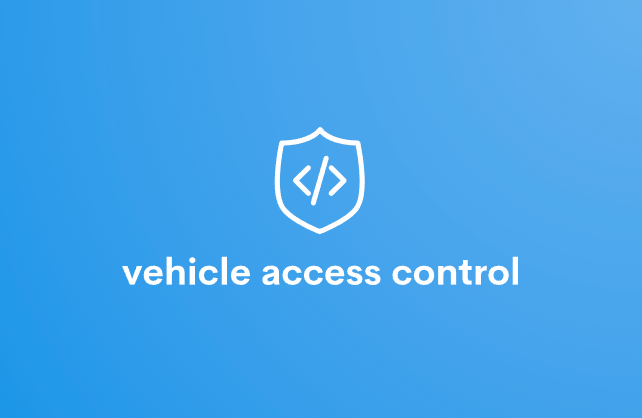

    
    <h1 >Controle de acesso de veículos</h1>
    <h4>
        <a href="https://github.com/vitorcesarlulio/vehicle-access-control/blob/main/assets/vehicle-access-control-documentation.pdf" target="_blank">Documentação</a>
         · 
        <a href="https://github.com/vitorcesarlulio/vehicle-access-control/" target="_blank">Veja você mesmo</a>
    </h4>

  
Índice

  <ol>
    <li><a href="#sobre-o-projeto">Sobre o projeto</a></li>
    <li><a href="#tecnologias">Tecnologias</a></li>
    <li><a href="#começando">Começando</a></li>
    <ul>
        <li><a href="#pré-requisitos">Pré-requisitos</a></li>
        <li><a href="#instalação">Instalação</a></li>
        <li><a href="#utilizando">Utilizando</a></li>
    </ul>
    <li></li>
    <li><a href="#roadmap">Roadmap</a></li>
    <li><a href="#contribuir">Contribuir</a></li>
    <li><a href="#licença">Licença</a></li>
    <li><a href="#referências">Referências</a></li>
  </ol>

## Sobre o projeto

Aplicativo para controle de acesso de veículos para faculdade

> Demonstração do Controle de acesso de veículos.

## Começando

### Pré-requisitos

### Instalação
  Front-end
  Instalando dependencias do package.json
	  npm install

  Rodando aplicação
    node app.js

  [localhost:](http://localhost:8098/)

#### Dependências
pip install -r requirements.txt
